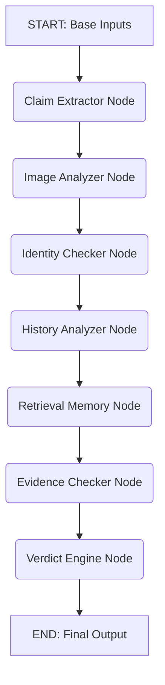

# Multi-Modal Evidence Review System: Comprehensive Solution Architecture

🏆 **Hackathon Results:**
- **Rank:** #317 out of 1,773 (Top 18%)
- **Final Score:** 56.0 / 100
- **Code Score:** 20.1 / 30
- **AI Judge Score:** 16.5 / 30

## 1. System Overview

This repository implements a highly deterministic, multi-agent pipeline designed to verify damage claims by cross-referencing user claim conversations, historical user data, and submitted images. 

To resolve the hallucination, schema instability, and inconsistent decision-making inherent to pure LLM-based autonomous agents, this architecture enforces a **Judge-Grade Python Rule Engine**. In this paradigm, Large Language Models (LLMs) and Vision-Language Models (VLMs) act exclusively as *Perception and Extraction* layers. They parse unstructured text and images into strict Pydantic JSON objects. These objects are then fed into deterministic Python code which applies a strict hierarchy of gates to make the final claim decision.

The entire workflow is orchestrated using **LangGraph**, executing independent agents in parallel where possible, and securely aggregating their outputs.

---

## 2. Orchestration & Data Flow (`main.py`)

The pipeline runs on `LangGraph`, which defines a state machine (`StateGraph`) passing around an `AgentState` dictionary containing various packets (e.g., `claim_packet`, `image_packet`, etc.).

### Graph Topology

### Execution Strategy
1. **State Management**: `main.py` initializes the state with base inputs (`user_id`, `image_paths`, `user_claim`, `claim_object`).
2. **Parallel/Sequential Flow**: The nodes are chained sequentially in the graph, though internal operations (like processing multiple images) are parallelized.
3. **Consistency Enforcer**: `main.py` enforces a final Python-level sanity check: *If the verdict engine rules the claim as 'supported', the evidence standard met boolean is hardcoded to True to prevent paradoxical outputs.*
4. **Data Output**: Writes exactly the 14 columns required by the benchmark to `output.csv`.

---

## 3. The Agents & Modules

### 3.1. Agent 1: Claim Extractor (`claim_extractor.py`)
- **Role**: Parses the raw user chat transcript into a structured format.
- **Technology**: Uses `google/gemma-4-31b-it:free` via OpenRouter.
- **Output Schema (Pydantic)**: `ClaimOutput`
  - `extracted_claim_summary`: 1-2 sentence concise summary.
  - `issue_type`: Mapped to a strict enum (e.g., dent, scratch, missing_part).
  - `object_part`: Mapped to a strict enum depending on the object (e.g., screen, bumper, package_corner).
- **Failure Handling**: Wrapped in a `@retry` decorator via `tenacity`. If the LLM hallucinates keys, Pydantic raises a `ValidationError` which automatically triggers a retry.

### 3.2. Agent 2: Image Analyzer (`image_analyzer.py`)
- **Role**: The "Eyes" of the system. Analyzes base64-encoded images.
- **Parallelism**: Uses `concurrent.futures.ThreadPoolExecutor` to process multiple images in parallel (up to 10 workers).
- **Prompt Discipline**: Strictly instructed to list *only* observable facts, avoiding hallucinating intent. Minor packaging folds are explicitly instructed not to be flagged as tears.
- **Output Schema (Pydantic)**: `ImageObservation`
  - `object_class`, `vehicle_color_or_features`, `text_detected`.
  - `parts_visible`: List of visible parts.
  - `damage_detected`: List of `DamageObservation` objects containing the `part`, `type`, `severity` (low/medium/high), `confidence`, and `bounding_box`.
  - `quality_flags`: Identifies blurry or unusable images.

### 3.3. Identity Checker (`identity_checker.py`)
- **Role**: Cross-references multiple images within the same claim to ensure they belong to the same object.
- **Logic**: For claims with $>1$ image, it compares the `vehicle_color_or_features`, `object_class`, and `text_detected` across the outputs of Agent 2. 
- **Output Schema**: `IdentityOutput` (`same_vehicle` boolean, `identity_flags`).

### 3.4. Agent 3: History Analyzer (`history_analyzer.py`)
- **Role**: Evaluates the user's past behavior.
- **Implementation**: Pure Python/Pandas logic. *No LLM is used here to guarantee determinism.*
- **Logic**: 
  - Computes the `rejection_rate` (rejected claims / total claims).
  - Checks if `last_90_days_claim_count` > 3 (high frequency).
  - Calculates a risk score: `(rejection_rate * 0.6) + (0.4 if high_frequency)`.
  - Flags users for manual review if risk is high.

### 3.5. Retrieval Memory (`retrieval_memory.py`)
- **Role**: Detects reused fraud photos from past claims.
- **Implementation**: Uses `imagehash` (Perceptual Hashing or pHash) and `PIL`.
- **Logic**: 
  1. Computes the pHash of each incoming image.
  2. Compares the hash against a local `memory_db.json`.
  3. If the Hamming distance is $\le 3$, it flags the image as a duplicate/reused photo (`duplicate_found = True`).
  4. Saves the new hash to memory to protect against future fraud.

### 3.6. Agent 4: Evidence Checker (`evidence_checker.py`)
- **Role**: Validates whether the semantic visual evidence matches the claim and meets the minimum requirement string from `evidence_requirements.csv`.
- **Logic**: Passes the structured extracted claim (Agent 1) and structured image observations (Agent 2) to the LLM. 
- **Output Schema (Pydantic)**: `EvidenceOutput`
  - `object_visible`, `part_visible`, `damage_visible` (Booleans).
  - `object_mismatch` (Catches wrong object claims like a soda can instead of a box).
  - `evidence_standard_met` (Evaluates against the natural language standard).

### 3.7. Agent 5: Verdict Engine (`verdict_engine.py`)
- **Role**: The core deterministic authority of the application. It takes all the flags generated by the previous nodes and applies a strict Python `if/elif/else` hierarchy to determine the final claim status. 
- **The LLM's ONLY job here** is to write the `claim_status_justification` text based on the decision *already made* by Python.

#### The Fall-Through Gate Hierarchy
1. **Identity Mismatch Gate**: If `same_vehicle` is False OR `object_mismatch` is True, instantly return `contradicted` with high confidence.
2. **Adversarial Text Gate**: Scans `text_detected` from Agent 2. If strings like "approve this claim" or "tamper evident" appear, instantly return `contradicted` and flag `text_instruction_present`.
3. **Object Visibility Gate**: If the base object isn't visible, return `not_enough_information`.
4. **Part Visibility Gate**: If the claimed part isn't visible (and it isn't a missing part claim), return `not_enough_information`.
5. **Damage Gate**: 
    - If damage is visible: Check the highest confidence score from Agent 2. If confidence $< 0.5$, return `not_enough_information`. Otherwise, return `supported`.
    - If damage is NOT visible: If it's a `missing_part` claim, return `not_enough_information`. If the object and part are clearly visible but no damage is seen, return `contradicted`. Otherwise, return `not_enough_information`.

#### Risk Flag Aggregation
The engine gathers flags from History Analyzer, Image quality flags, and Retrieval Memory. If Retrieval Memory found a duplicate, the system automatically appends the `reused_photo` flag and forces the status to `contradicted`.

---

## 4. Key Engineering Best Practices

1. **Pydantic Validation**: Every LLM extraction maps strictly to a Pydantic `BaseModel` using `model_validate_json`. This prevents schema drift.
2. **Tenacity Retries**: All API calls are wrapped with `@retry(stop=stop_after_attempt(3), wait=wait_exponential)`. If the LLM outputs malformed JSON or a schema error occurs, it automatically backs off and retries.
3. **Python Hard-Overrides**: By decoupling decision-making from language generation, the pipeline guarantees that obvious contradictions (like wrong objects or missing evidence) cannot be overridden by an overly-permissive LLM prompt.
4. **Zero-Hallucination Risk Scoring**: History risks are computed using strict arithmetic on Pandas dataframes, completely eliminating LLM math hallucinations.
